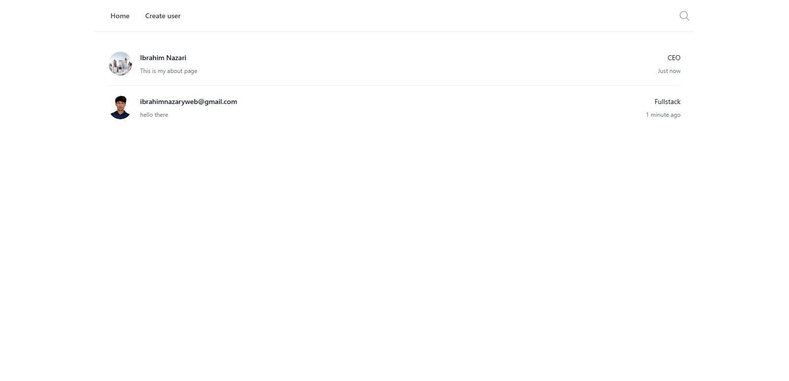
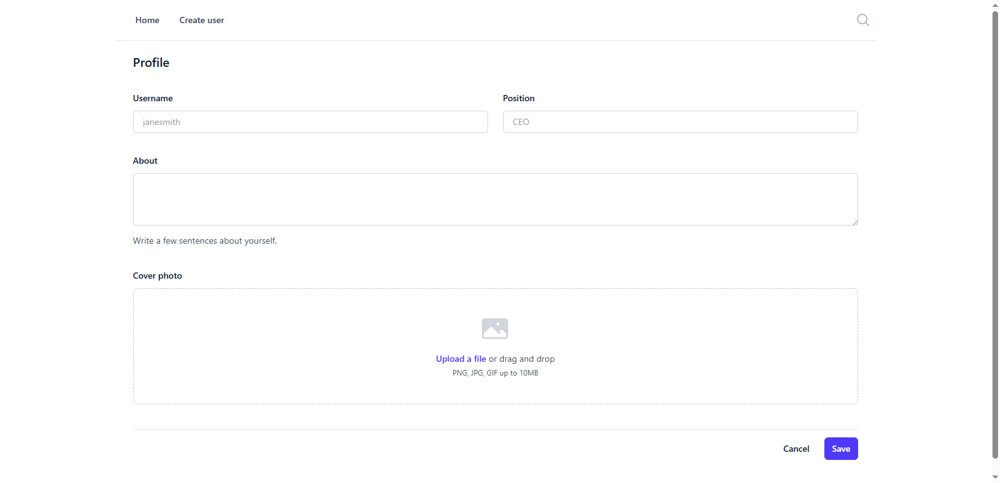

# 📌 Simple PHP User Management App

A lightweight PHP project using **SQLite**, **PDO**, and a simple MVC-style folder structure.

Features:

- Add user
- List users
- Upload user photo
- Uses SQLite database
- Clean and minimal codebase for learning and extension

---

## 📸 Screenshots

Below are some screenshots of the application.

### Home Page



### Add User Form



---

## 📁 Project Structure

## 📁 Project Structure

```

│
├── public/
│ ├── index.php # Home page
│ ├── create.php # Create/Add user
│ ├── users.php # List all users
│ ├── uploads/ # Uploaded user photos
│ └── assets/ # CSS / JS files
│
├── src/
│ ├── db.php # SQLite database connection using PDO
│ ├── User.php # User model (CRUD functions)
│
├── storage/
│ └── database.sqlite # SQLite database file
│
├── views/
│ ├── header.php # Header layout
│ ├── footer.php # Footer layout
│ ├── form.php # Add user form
│ ├── users_list.php # User list component
│
└── README.md

---
```

## 🚀 Getting Started

### 1️⃣ Clone the Repository

```bash
git clone https://github.com/YOUR_USERNAME/simple-php-app.git
cd simple-php-app
```
